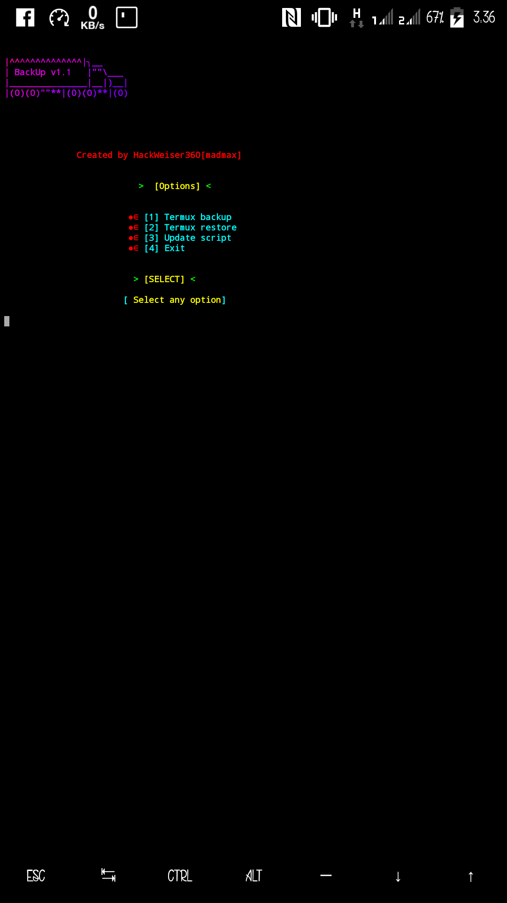

# Termux-Backup

Termux-Backup is a bash based tool for backing up and restoring Termux data. It works in both rooted and non rooted devices.Perfect!!! I tested the tool in Termux only but you can try installing it in Kali or another operating system.

***
## [~] Installation and Usage

* $ apt update 
* $ apt upgrade 
* $ pkg install python 
* $ pkg install python2 
* $ pkg install git 
* $ pip install lolcat
* $ git clone https://github.com/HackWeiser360/Termux-Backup
* $ cd $HOME
* $ ls
* $ cd Termux-Backup
* $ ls
* $ bash Termux-Backup.sh
***
### [+] Follow on [Instagram](https://www.instagram.com/madmax4708/)
### [+] Visit our YouTube channel. [Why not?](https://youtube.com/channel/UC02OkpTZkxRZCEzFjawf6mA)
### [+] Visit our [FaceBook Page](fb.me/HackWeiser360)
### [+] You can leave a message [here](m.me/HackWeiser360)
